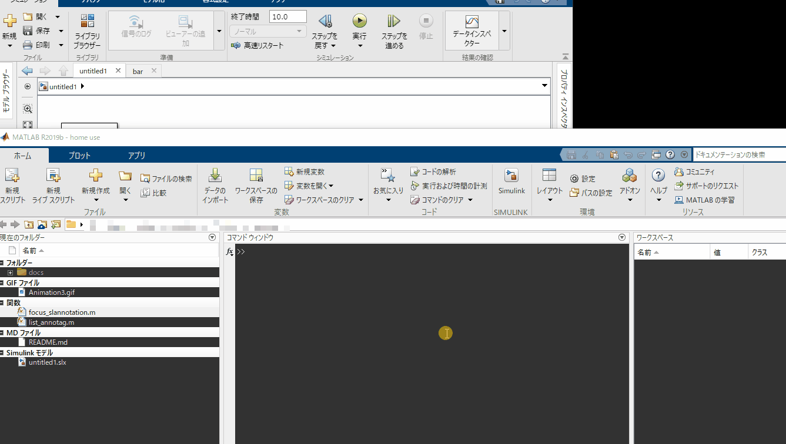

# lists "annotation tags" for Simulink model

この関数は、Simulinkモデル内の “アノテーションタグ” 付き注釈を検索してリスト表示します。

“アノテーションタグ” とは、`TODO:`, `FIXME:` などの特定キーワードではじまる注釈です。



-----

## Usage

1. `list_annotag.m`, `focus_slannotation.m` のmファイルをMATLABパス有効化します。
2. 任意のSimulinkモデル内で以下のような注釈を書きます。
   ```
   TODO: あとで作業する
   ```
3. MATLABコマンドウインドウ上で以下のコマンドを入力して実行します。
   ```matlab
   list_annotag
   ```
   2.で書いた注釈が検索されてリストとなって表示されます。
   リストのパスをクリックすると注釈にフォーカスします。
4. 2.で書いた注釈オブジェクトを削除します。
5. 再びMATLABコマンドウインドウで以下のコマンドを入力して実行します。
   ```matlab
   list_annotag
   ```
   今度は何も検索されないはずです。

-----

## Syntax

    list_annotag(mdl, tag)
    list_annotag(mdl)
    list_annotag([], tag)
    list_annotag()
    find_result = list_annotag(____)

`list_annotag(mdl, tag)` は、
[`mdl`](#mdl-char) に指定されたSimulinkモデルを検索対象として、
[`tag`](#tag-char--1xn-cellchar) に指定されたアノテーションタグを検索・リスト化します。

`list_annotag(mdl)` は、
[`mdl`](#mdl-char) に指定されたSimulinkモデルを検索対象として、
[デフォルトのアノテーションタグ](#デフォルトのアノテーションタグ) を検索・リスト化します。

`list_annotag([], tag)` は、
現在アクティブなモデル `bdroot` を検索対象として、
[`tag`](#tag-char--1xn-cellchar) に指定されたアノテーションタグを検索・リスト化します。

`list_annotag()` は、
現在アクティブなモデル `bdroot` を検索対象として、
[デフォルトのアノテーションタグ](#デフォルトのアノテーションタグ) を検索・リスト化します。

`find_result = list_annotag(____)` は、
検索結果を構造体配列で返します。

-----

## 入力引数

### `mdl` [char]

検索対象のSimulinkモデル名。
省略した場合は、現在アクティブなモデル `bdroot` を検索対象にします。

### `tag` [char | 1xN cell(char)]

検索対象のアノテーションタグを指定します。
省略した場合は、 [デフォルトのアノテーションタグ](#デフォルトのアノテーションタグ) で検索します。

* ex) `'FIXME'`
* ex) `{'TODO', 'MEMO'}`

-----

## 出力引数

### `find_result` [1xN struct]

タグごとの検索結果を格納した情報。
1xNの構造体配列で返します。(Nはtagで指定した検索対象タグの数)

以下のフィールドを有しています。

| field name | type | description |
| --- | --- | --- |
| `Tag` | char | タグ名 |
| `Object` | 1xM cell(Simulink.Annotationオブジェクト) | 検索で抽出された注釈オブジェクトを1xMのセル配列で返します。(Mは検索された注釈の数) |

-----

## デフォルトのアノテーションタグ

[`tag`](#tag-char--1xn-cellchar) 引数を省略した場合のデフォルトのアノテーションタグは `{'TODO', 'FIXME', 'XXX', 'REVIEW', 'OPTIMIZE', 'CHANGED', 'NOTE', 'WARNING'}` です。

-----

## Notes

* 注釈にタグを書くときは `TODO: コメントを書く` のように、
  「先頭から書き始める」「半角コロンと半角スペースで終える」
  というルールに基づいて書いて下さい。
* 注釈の前景色・背景色・フォントスタイルなどは検索に影響しません。
* 大文字小文字は区別して検索します。
* 検索対象のSimulinkモデルはあらかじめ開いた状態で検索実行して下さい。


